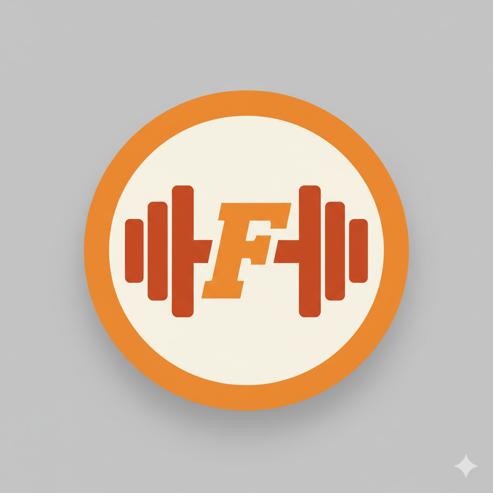

# 🏋️‍♂️ FitZone - Gym Landing Page



A modern, responsive landing page for FitZone gym built with React and Tailwind CSS. Features a clean design, smooth animations, and mobile-first approach perfect for fitness businesses.

## 🌟 Features

- **Responsive Design** - Optimized for all devices (desktop, tablet, mobile)
- **Modern UI/UX** - Clean and professional design with smooth animations
- **Interactive Contact Form** - Functional contact form with validation
- **Service Showcase** - Display gym services with attractive cards
- **About Section** - Company information with statistics
- **Firebase Ready** - Pre-configured for Firebase integration
- **PWA Support** - Manifest and favicon configuration included
- **SEO Optimized** - Meta tags and structured content

## 🚀 Technologies Used

- **React** 19.2.0 - Modern JavaScript library
- **Tailwind CSS** 3.3.0 - Utility-first CSS framework
- **Firebase** 12.4.0 - Backend services (configured)
- **PostCSS** & **Autoprefixer** - CSS processing
- **React Scripts** - Build and development tools

## 📱 Sections

1. **Header** - Navigation with responsive mobile menu
2. **Hero** - Main banner with call-to-action buttons
3. **About** - Company information and statistics
4. **Services** - 6 service cards with hover effects
5. **Contact** - Contact form and business information
6. **Footer** - Links, social media, and additional info

## 🛠️ Installation & Setup

1. **Clone the repository**

   ```bash
   git clone https://github.com/YOUR_USERNAME/fitzone-gym-landing.git
   cd fitzone-gym-landing
   ```

2. **Install dependencies**

   ```bash
   npm install
   ```

3. **Start development server**

   ```bash
   npm start
   ```

   - Open [http://localhost:3000](http://localhost:3000) to view in browser
   - Page reloads automatically when you make changes

4. **Build for production**
   ```bash
   npm run build
   ```
   - Creates optimized production build in `build` folder

## 🎨 Customization

### Colors

- Primary color: Orange (#f97316)
- Customize in `tailwind.config.js` or component files

### Content

Update content in component files:

- `src/components/Hero/Hero.jsx` - Main banner
- `src/components/About/About.jsx` - Company info
- `src/components/Services/Services.jsx` - Services
- `src/components/Contact/Contact.jsx` - Contact info

## 🔧 Firebase Setup

1. Create Firebase project
2. Update `src/firebaseConfig.js` with your credentials
3. Enable desired services (Firestore, Auth, etc.)

## 🌐 Deployment

### Netlify

- Build command: `npm run build`
- Publish directory: `build`

### Vercel

- Auto-deploys from GitHub

### Firebase Hosting

```bash
npm install -g firebase-tools
firebase login
firebase init hosting
npm run build
firebase deploy
```

## 📊 Performance Features

- Lighthouse Score: 95+
- Mobile-first responsive design
- SEO optimized with meta tags
- PWA ready with manifest

---

⭐ **Give this project a star if you found it helpful!** ⭐
